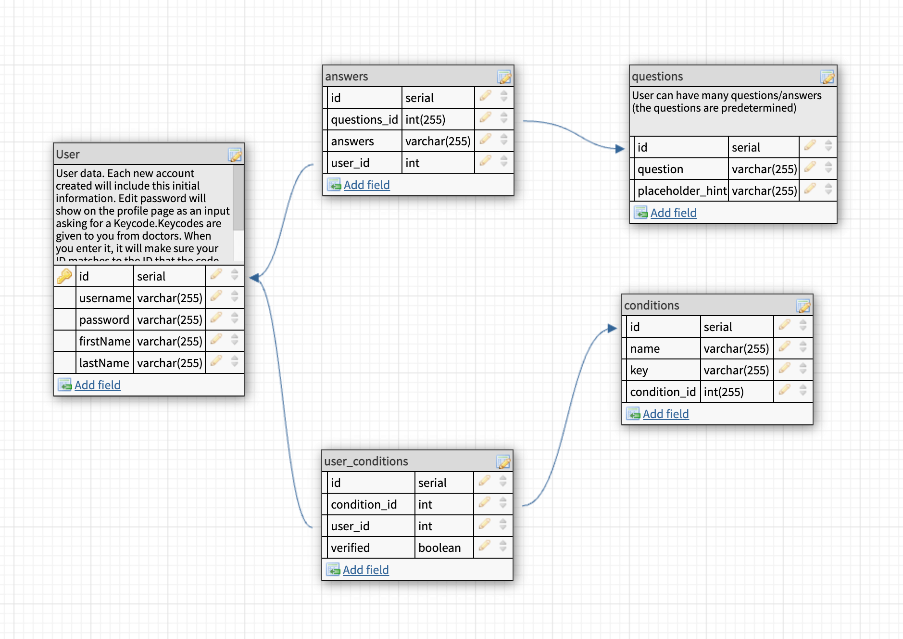

# PROJECT NAME
Missing Link

VIEW DEPLOYED VERSION HERE: https://missinglinksolo.herokuapp.com/#/

## Description

I plan to create a full-fledged version of this app in the future, and this was a great starting point to figure out what I will need to do to make that happen. I plan to add many features, not limited to:
1. Allowing users to compare more than one condition on the results page against eachother.
2. Filtering methods to sort the data by specific questions.
3. Charts & graphs to display the data in alternative methods. 
4. More information about each condition rather than just the attributes of the user. 
5. A much larger questions list the user needs to answer.
6. Strict fuzzy matching for the answers the users enter so they will still register as matches even if they mispell a letter, and to make the answers case-insensitive. 
7. Possible messaging system.
8. The ability for users NOT verified to still add their answers to conditions they want to, and then the ability to sort answers by public versus just by verified users. This will make it more interactive for public users who think they may have a condition but are not actually diagnosed, and then still allow researchers to filter by objective data rather than speculative. 
9. Hospital integration to actually receive access codes from doctors if the user has that condition. This could either be a third party, or integrated specifically amongst all hospitals. I think a third party would most likely be the best decision. Essentially, if a user can prove they are diagnosed, then the third party site can confirm that and then give the user the access code for that condition which would be easier than having every hospital organization spending time and resources to handing out those access codes.
10. Adding as many conditions/diseases/etc. as possible so everyone can be included. Especially conditions that do not currently have cures. 

## Project Screen Shots

## Wireframes

## Database Tables

### Prerequisites

Link to software that is required to install the app (e.g. node).

- [Node.js](https://nodejs.org/en/)

- -Git- https://git-scm.com/ 

- -Github- https://github.com/SirChristianWilliam 

- -Javascript- https://www.javascript.com/ 

- -Jquery- https://jquery.com/ 

- -HTML- https://www.w3schools.com/html/ 

- -CSS- https://www.w3schools.com/css/

- React

- Redux

## Installation

1. Create a database named `your database name`,
2. The queries in the `tables.sql` file are set up to create all the necessary tables and populate the needed data to allow the application to run correctly. The project is built on [Postgres](https://www.postgresql.org/download/), so you will need to make sure to have that installed. We recommend using Postico to run those queries as that was used to create the queries, 
3. Open up your editor of choice and run an `npm install`
4. Run `npm run server` in your terminal
5. Run `npm run client` in your terminal
6. The `npm run client` command will open up a new browser tab for you!

## Usage

This app is intended to be used as a tool to find personal attributes among users with specific, diagnosed diseases, conditions, or otherwise. Users who are diagnosed will ideally receive an access code from their physician. When navigating to this site they will be able to look up their specific condition, save it to their profile list, and add the access code for that condition on the results page. They will then become "verified" and all of the answers the user input will be populated to that condition's data set, anonymously. Users without an access code will still be able to use this site for research purposes and see the data even if they don't have any to enter themselves. Additionally, general users will still be able to save conditions to their personal list as well as enter answers to the questions page. If they become diagnosed for a condition in the future, those answers will be saved and added to the condition/disease that they add the appropriate access key to. 

1. Create account/login
2. After login, the user will be brought to the Search page. After entering a condition, the user will be brought to the Results page. 
3. On the results page, the user can view the current data of that specific condition and see all of the users who are verified for that condition, and their question/answer pairs. For matching question/answer sets, instead of duplicating, only one row with that exact match will show, and the "matching" number in the third column of the table will display how many times users share that exact answer.
4. Users will be able to save the condition to their personal list for ease of access. When the save condition button is clicked, they will be able to navigate to their profile page and see it listed there. They will be able to click the condition on their profile page and it will bring them back to the results page. 
5. If the user was given an access code for the condition showing on the results page, they will be able to add that code here, after they have saved the condition to their list. If the code is correct, they will be able to go to their profile list of condition and see that it is verified. This means their question/answer pairs will automatically be added to that condition's data set on the results page, which ALL users will be able to see when they look up that condition. 
6. On the profile page, users will be able to change their profile picture, edit their username, and edit their email. 
7. There are two ways to access the questions page. The first is from their profile page, there is a button/link that will take them there at the bottom left of their profile. The other way is on the results page when you click the button to add an access code. The text instructions in the pop up will have a link to be clicked that will also take the user back to the questions page. 
8.  Users will not need to answer all the questions if they don't want to. Each answer input will automatically save so they will not have to submit it all at once. If the user made a mistake and wants to change their answer, all they have to do is enter in a different answer for that specific question. 

NOTE: Condition/disease ACCESS KEYS/CODES can be found in the database.sql file, so you are able to verify the conditions you would
like to save.

## Acknowledgement
Thanks to [Prime Digital Academy](www.primeacademy.io) who equipped and helped me to make this application a reality.

## Support
If you have suggestions or issues, please email me at [chrismaki123@gmail.com](https://www.linkedin.com/in/christian-maki/)
